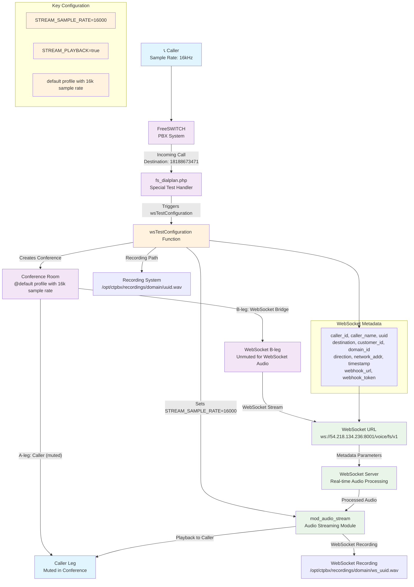

# wsTestConfiguration Architecture Diagram

## Overview
The `wsTestConfiguration` function creates a bi-directional audio streaming setup between a caller and a WebSocket endpoint for real-time audio processing.

## Architecture Flow

## Key Components and Connections

### 1. **Caller Leg (A-leg)**
- **Sample Rate**: 16,000 Hz (16 kHz)
- **Status**: Muted in conference
- **Purpose**: Receives audio from WebSocket, sends audio to WebSocket

### 2. **WebSocket B-leg**
- **Profile**: `default` (with explicit 16kHz sample rate)
- **Status**: Unmuted in conference
- **Purpose**: Bridges audio between caller and WebSocket server

### 3. **WebSocket Connection**
- **URL**: `ws://54.218.134.236:8001/voice/fs/v1`
- **Metadata**: Includes caller info, UUID, destination, timestamps, webhook details
- **Purpose**: Real-time bi-directional audio streaming

### 4. **Audio Streaming Module (mod_audio_stream)**
- **Configuration**: `STREAM_PLAYBACK=true`, `STREAM_SAMPLE_RATE=16000`
- **Purpose**: Handles real-time audio streaming and playback
- **Features**: Supports both JSON base64 and raw binary audio

### 5. **Recording System**
- **Caller Recording**: `/opt/ctpbx/recordings/{domain}/{uuid}.wav`
- **WebSocket Recording**: `/opt/ctpbx/recordings/{domain}/ws_{uuid}.wav`
- **Purpose**: Records both caller audio and WebSocket responses

## Audio Flow Process

1. **Incoming Call**: Caller dials 18188673471
2. **Configuration**: `wsTestConfiguration` generates FreeSWITCH XML dialplan
3. **Conference Setup**: Creates conference with caller (muted) and WebSocket bridge (unmuted)
4. **WebSocket Connection**: Establishes connection to external WebSocket server
5. **Audio Streaming**: 
   - Caller audio → WebSocket server (for processing)
   - WebSocket audio → Caller (for playback)
6. **Recording**: Both streams are recorded separately

## Special Features

- **Auto-answer**: Automatically answers the test call
- **Bi-directional**: Full-duplex audio streaming
- **Real-time**: Low-latency audio processing
- **Recording**: Dual recording of both audio streams
- **Metadata**: Rich call information passed to WebSocket server

## Configuration Triggers

The `wsTestConfiguration` is triggered when:
- Destination number is `18188673471` or `+18188673471`
- Call comes through the FreeSWITCH dialplan
- Domain and customer details are available
